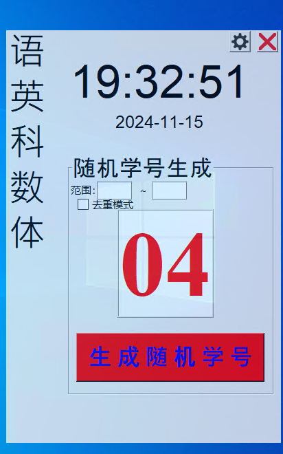

# 电教助手
*本软件仅使用与中国地区, 仅提供中文版本, 非中国人员请勿使用*

*This software is only for use in China and is only available in Chinese. Non-chinese personnel are not allowed to use it*

着是一款专注于帮助中国电教委员操作电脑的轻量级软件, 使用Python编写, 主要使用`Tkinter`提供窗口操作, 使用第三方库情况如下:

- keyboard 用于锁定键盘
- PIL (Pillow) 用于图像处理
- PyAutoGUI 用于监听鼠标事件
- PyWin32 对Windows系统底层事件进行处理, 用于监听鼠标点击事件
- Pynput 用于监听键盘事件

在此向Python开发者和第三方库工作者们表示真诚热烈的感谢!

## 软件功能简述
电教助手共有以下一些功能:
### 1.自动隐藏
本软件启动时会自动置顶, 为防止影响操作, 会自动在一定时间没有事件后进入休眠状态, 此时软件占用屏幕空间较小, 仅能显示课表, 只要点击软件本体即可恢复

### 2.课表显示
电教助手可显示课表, 在休眠状态和活动状态均可显示。如需调整课表, 可使用记事本打开源目录下的data目录中的`classTable.csv`文件进行编辑

### 3.锁🔒定电脑
在电脑无操作一段时间后, 电教助手会自动开启锁定功能, 用来防止某些**同学胡乱操作电脑
(比如我们班的毕垂昇同学), 开启后导致无法操作电脑。此时点击
屏幕会弹出密码框。可根据需求调整, 点击主窗口中的设置按钮即可!
初始无密码。

### 4.随机🔀学号生成
软件主界面就有随机学号生成, 可自行使用!

## 贡献
- nanocode38